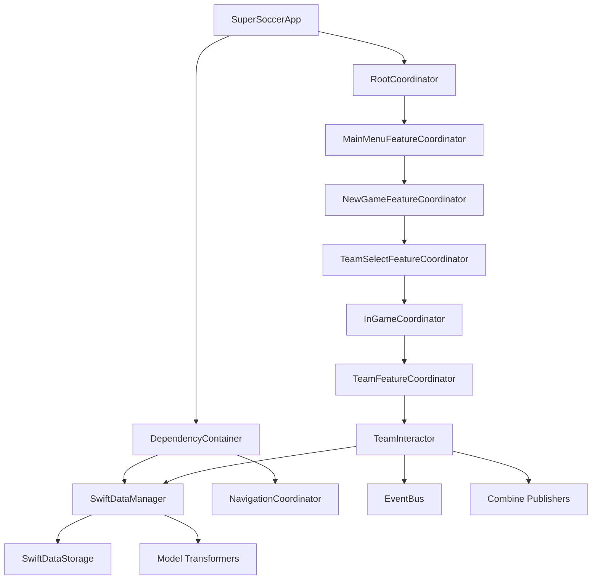

# Codebase Navigation Map

## Most Important Files (Start Here)

### Core Architecture Files
1. **`SuperSoccer/Sources/Navigation/BaseFeatureCoordinator.swift`**
   - Foundation of navigation system
   - Automatic child coordinator management
   - All feature coordinators inherit from this

2. **`SuperSoccer/Sources/Dependency/DependencyContainer.swift`**
   - Central dependency injection
   - All protocol implementations configured here
   - Mock switching for tests

3. **`SuperSoccer/Sources/DataManager/SwiftData/SwiftDataManager.swift`**
   - Core data operations
   - Publisher setup for reactive UI
   - Transformer integration point

4. **`SuperSoccer/Sources/DesignSystem/Theme/SSTheme.swift`**
   - Design system entry point
   - Theme configuration and environment setup
   - Used by all UI components

5. **`SuperSoccer/Sources/Navigation/ViewFactory.swift`**
   - Screen creation and navigation routing
   - SSThemeProvider application
   - All screen construction logic

## Feature Entry Points

### Current Implemented Features

#### MainMenu Feature
- **Entry**: `SuperSoccer/Sources/Features/MainMenu/MainMenuFeatureCoordinator.swift`
- **Business Logic**: `SuperSoccer/Sources/Features/MainMenu/MainMenuInteractor.swift`
- **UI**: `SuperSoccer/Sources/Features/MainMenu/MainMenuView.swift`
- **Tests**: `SuperSoccerTests/Features/MainMenu/`

#### NewGame Feature
- **Entry**: `SuperSoccer/Sources/Features/NewGame/NewGameFeatureCoordinator.swift`
- **Business Logic**: `SuperSoccer/Sources/Features/NewGame/NewGameInteractor.swift`
- **UI**: `SuperSoccer/Sources/Features/NewGame/NewGameView.swift`
- **Data Source**: `SuperSoccer/Sources/Features/NewGame/NewGameLocalDataSource.swift`
- **Tests**: `SuperSoccerTests/Features/NewGame/`

#### TeamSelect Feature
- **Entry**: `SuperSoccer/Sources/Features/TeamSelect/TeamSelectFeatureCoordinator.swift`
- **Business Logic**: `SuperSoccer/Sources/Features/TeamSelect/TeamSelectInteractor.swift`
- **UI**: `SuperSoccer/Sources/Features/TeamSelect/TeamSelectView.swift`
- **Components**: `SuperSoccer/Sources/Features/TeamSelect/TeamSelectorView.swift`
- **Tests**: `SuperSoccerTests/Features/TeamSelect/`

#### Team Feature (Most Complete)
- **Entry**: `SuperSoccer/Sources/Features/Team/TeamFeatureCoordinator.swift`
- **Business Logic**: `SuperSoccer/Sources/Features/Team/TeamInteractor.swift`
- **UI**: `SuperSoccer/Sources/Features/Team/TeamView.swift`
- **Components**: 
  - `SuperSoccer/Sources/Features/Team/PlayerRowView.swift`
  - `SuperSoccer/Sources/Features/Team/TeamHeaderView.swift`
- **ViewModels**: `SuperSoccer/Sources/Features/Team/TeamViewModel.swift`
- **Tests**: `SuperSoccerTests/Features/Team/` (Complete template for other features)

#### InGame Feature
- **Entry**: `SuperSoccer/Sources/Features/InGame/InGameCoordinator.swift`
- **Purpose**: Tab navigation container for in-game features

## Data Layer Architecture

### 3-Layer Data Flow
```
UI Layer → DataManager Layer → Storage Layer
   ↓             ↓              ↓
Views        DataManager    SwiftDataStorage
   ↓             ↓              ↓
Client       Transformers   SwiftData
Models        (Bridge)       Models
```

### Key Data Files

#### DataManager Layer
- **`SuperSoccer/Sources/DataManager/DataManagerProtocol.swift`** - Interface definition
- **`SuperSoccer/Sources/DataManager/SwiftData/SwiftDataManager.swift`** - Implementation
- **`SuperSoccer/Sources/DataManager/SwiftData/SwiftDataManagerFactory.swift`** - Factory pattern
- **`SuperSoccer/Sources/DataManager/SwiftData/SwiftDataStorage.swift`** - Storage operations

#### Client Models (What UI Uses)
- **`SuperSoccer/Sources/DataModels/ClientModels/Core/`**
  - `Team.swift` - Team data structure
  - `Player.swift` - Player data structure
  - `Coach.swift` - Coach data structure
  - `League.swift` - League data structure
  - `Career.swift` - Career data structure

#### SwiftData Models (Persistence Layer)
- **`SuperSoccer/Sources/DataModels/SwiftDataModels/`**
  - `SDTeam.swift` - Persisted team data
  - `SDPlayer.swift` - Persisted player data
  - `SDCoach.swift` - Persisted coach data
  - All prefixed with `SD`

#### Transformers (Bridge Layer)
- **`SuperSoccer/Sources/DataModels/Transforms/SwiftData/ClientToSwiftDataTransformer.swift`**
- **`SuperSoccer/Sources/DataModels/Transforms/SwiftData/SwiftDataToClientTransformer.swift`**

## Navigation System

### Core Navigation Files
- **`SuperSoccer/Sources/Navigation/RootCoordinator.swift`** - App-level navigation
- **`SuperSoccer/Sources/Navigation/NavigationCoordinator.swift`** - Navigation operations
- **`SuperSoccer/Sources/Navigation/NavigationRouter.swift`** - Route definitions
- **`SuperSoccer/Sources/Navigation/TabNavigationCoordinator.swift`** - Tab navigation
- **`SuperSoccer/Sources/Navigation/TabContainerView.swift`** - Tab UI container

### Navigation Flow
```
App Launch → RootCoordinator
     ↓
MainMenuFeatureCoordinator
     ↓
NewGameFeatureCoordinator
     ↓
TeamSelectFeatureCoordinator
     ↓
InGameCoordinator (Tab Navigation)
     ↓
TeamFeatureCoordinator (In Tab)
```

## Design System

### Core Design System Files
- **`SuperSoccer/Sources/DesignSystem/Theme/SSTheme.swift`** - Main theme system
- **`SuperSoccer/Sources/DesignSystem/Theme/SSColors.swift`** - Color palette
- **`SuperSoccer/Sources/DesignSystem/Theme/SSFonts.swift`** - Typography system
- **`SuperSoccer/Sources/DesignSystem/Theme/SSSpacing.swift`** - Spacing system

### UI Components
#### Buttons
- **`SuperSoccer/Sources/DesignSystem/Components/Buttons/SSPrimaryButton.swift`**
- **`SuperSoccer/Sources/DesignSystem/Components/Buttons/SSSecondaryButton.swift`**
- **`SuperSoccer/Sources/DesignSystem/Components/Buttons/SSTextButton.swift`**

#### Text Components  
- **`SuperSoccer/Sources/DesignSystem/Components/Text/SSTitle.swift`**
- **`SuperSoccer/Sources/DesignSystem/Components/Text/SSLabel.swift`**

#### Form Components
- **`SuperSoccer/Sources/DesignSystem/Components/Form/SSTextFieldStyle.swift`**

### Design System Previews
- **`SuperSoccer/Sources/DesignSystem/Previews/`** - All preview files for components

## Testing Structure

### Test Organization (Mirrors Source Structure)
```
SuperSoccerTests/
├── App/
├── DataManager/SwiftData/
├── DataModels/Transforms/SwiftData/
├── Dependency/
├── Features/[FeatureName]/
├── Navigation/
└── Shared/
```

### Key Test Files
- **`SuperSoccerTests/Features/Team/TeamInteractorTests.swift`** - Complete testing template
- **`SuperSoccerTests/Features/Team/TeamFeatureCoordinatorTests.swift`** - Coordinator testing
- **`SuperSoccerTests/DataManager/SwiftData/SwiftDataManagerTests.swift`** - Data layer testing

## Dependencies Flow Chart



## Where to Find Things

### Adding New Feature
1. Start in `SuperSoccer/Sources/Features/[NewFeature]/`
2. Follow Team feature as template
3. Add to `NavigationRouter.swift` 
4. Register in `ViewFactory.swift`
5. Add tests in `SuperSoccerTests/Features/[NewFeature]/`

### Modifying Data Models
1. Update Client model in `SuperSoccer/Sources/DataModels/ClientModels/Core/`
2. Update SwiftData model in `SuperSoccer/Sources/DataModels/SwiftDataModels/`
3. Update transformers in `SuperSoccer/Sources/DataModels/Transforms/SwiftData/`
4. Add tests in `SuperSoccerTests/DataModels/Transforms/SwiftData/`

### Changing UI Styling
1. Modify design tokens in `SuperSoccer/Sources/DesignSystem/Theme/`
2. Update components in `SuperSoccer/Sources/DesignSystem/Components/`
3. Test in previews: `SuperSoccer/Sources/DesignSystem/Previews/`

### Navigation Changes
1. Update routes in `SuperSoccer/Sources/Navigation/NavigationRouter.swift`
2. Modify coordinators in respective feature directories
3. Update `ViewFactory.swift` if needed

### Adding Dependencies
1. Add protocol in appropriate module
2. Add implementation in same module
3. Add mock in #if DEBUG block
4. Register in `DependencyContainer.swift`

## Project Configuration Files

### Build Configuration
- **`SuperSoccer.xcodeproj/project.pbxproj`** - Xcode project settings
- **`SuperSoccer/Info.plist`** - App configuration
- **`.swiftlint.yml`** - Code style rules (if exists)

### Workspace
- **`supersoccer.code-workspace`** - VSCode/Cursor workspace settings

This map provides the complete navigation guide for understanding and working with the SuperSoccer codebase effectively. 